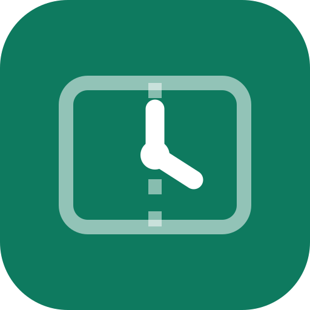
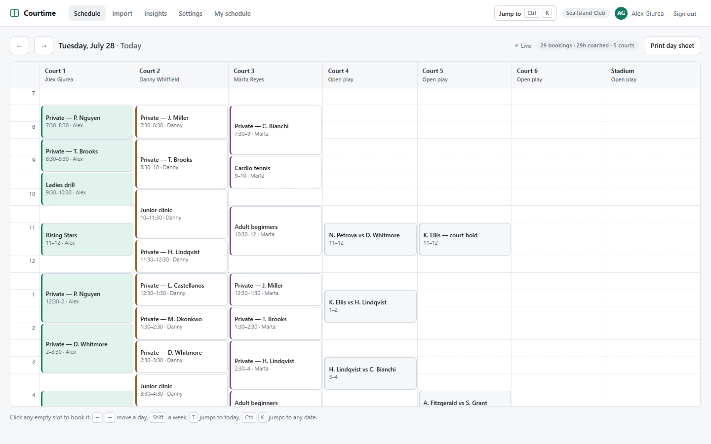
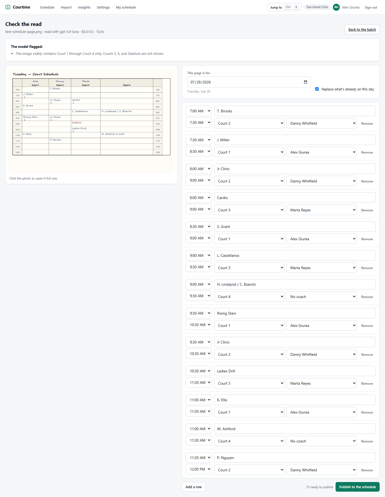
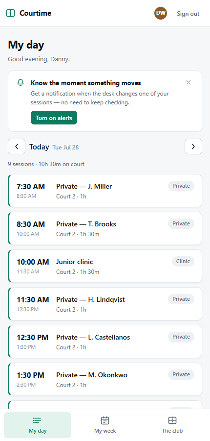
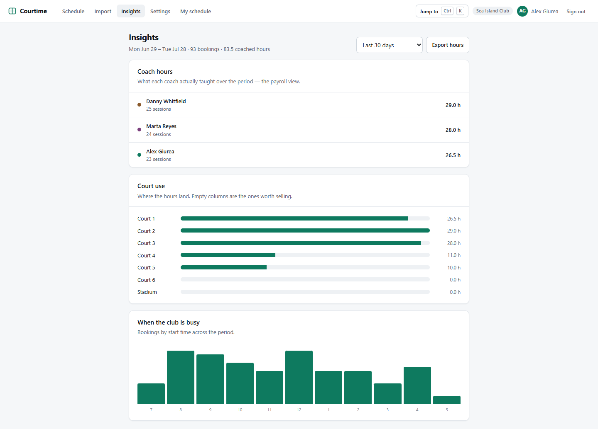

<div align="center">



# Courtime

**The club's paper schedule book, on every phone.**

The front desk photographs the page. Courtime reads the grid, a person confirms it, and every
coach opens their phone to the hours they're actually working — corrected the moment the desk
changes them.

</div>



## The problem

Racquet clubs run their entire court and lesson operation out of one handwritten book at the front
desk. That means:

- **The schedule exists in exactly one copy, in one place, in handwriting.** Coaches can't see
  their day without calling the desk, and a large share of the desk's phone calls are someone
  asking what time they're on court.
- **Changes don't propagate.** A member reschedules, the desk erases and rewrites, and the coach
  finds out at the gate — or not at all.
- **Leadership has no remote visibility**, and one coffee-stained page and the club runs blind.
  There is no backup and no audit trail.

Courtime removes all three without asking anyone to change how they work on day one. It is not a
booking platform or a member app — it is the schedule, shared.

## How it works

**1. Photograph the page.** Drop a stack of photos into the importer. A vision model reads the
grid: courts across, 30-minute slots down, coach names above the columns, continuation arrows that
mean "this booking runs another half hour."

**2. Verify in seconds.** The parse appears beside the photo with anything doubtful highlighted.
Verification is deterministic, not a second model call — a court that doesn't exist at this club, a
time outside its hours, a span off the 30-minute grid, two bookings on one court, a coach who isn't
on the staff list. **Nothing publishes until a person confirms it.**



**3. Every phone updates.** Coaches open a mobile web app — installable to the home screen — and
see only their own hours, live, with a push notification when something moves.

<div align="center">

</div>

## You don't have to give up paper

Courtime prints the day sheet in a layout the desk already recognises. During a pilot the paper
book stays the source of truth and Courtime simply mirrors it; after cutover the book prints itself
instead of being written by hand. That reversibility is the whole pitch to a club that has run on
paper for thirty years.

## Free and Pro

The **free tier is the complete calendar, forever**: the grid, keyboard navigation, photo import,
printable day sheets, unlimited coaches on their phones, live sync, and change alerts.

**Pro is $19 per club each month — flat, never per coach** — and adds the reporting a club office
actually spends its mornings on: court utilisation, coach load, and every coach's hours as a CSV
for payroll.



## Built with

| | |
|---|---|
| **Frontend** | React 18 · TypeScript · Vite · React Router |
| **Backend** | [Convex](https://convex.dev) — reactive database, server functions, file storage, scheduler |
| **Auth** | Convex Auth (password), roles enforced server-side on every query and mutation |
| **Vision** | OpenAI vision models, with per-page cost telemetry |
| **Notifications** | Web Push (VAPID) to an installable PWA |

Every surface is live because Convex queries are subscriptions — there is no polling code anywhere
in this repo. When the desk moves a booking, the coach's phone updates and the alert fires from the
same mutation.

## Running it

```bash
npm install
npx convex dev          # first run creates the deployment and writes .env.local
npm run dev:all         # Convex + Vite together → http://127.0.0.1:5183
```

Set these on the Convex deployment (`npx convex env set NAME value`):

| Variable | Purpose |
|---|---|
| `OPENAI_API_KEY` | vision model access for photo import |
| `VAPID_PUBLIC_KEY` / `VAPID_PRIVATE_KEY` / `VAPID_SUBJECT` | web push |
| `OPENAI_VISION_REASONING_EFFORT` | `low` by default |

and `VITE_VAPID_PUBLIC_KEY` in `.env.local` for the browser half of push. See
[`.env.example`](.env.example).

**Try it without setting anything up:** the sign-in screen seeds a demo club and offers one-click
entry as the front desk or as a coach.

## Repo map

```
src/desk/     the front-desk app — grid, entry editing, command palette, importer, insights
src/pro/      the coach's PWA — my day, my week, the club, push notifications
src/screens/  sign-in and the club onboarding wizard
convex/       schema, auth, scheduling, the import pipeline, push fan-out
landing/      the marketing site (static, no build step)
docs/SPEC.md  the canonical product and build spec
```

[`docs/SPEC.md`](docs/SPEC.md) is the source of truth for product decisions — the problem framing,
the migration playbook for a club with months already booked on paper, the data model, and what is
deliberately left to v2.

---

<div align="center">
<sub>Built for racquet clubs still running on paper.</sub>
</div>
